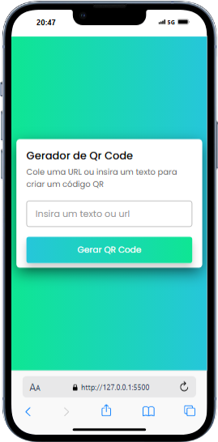
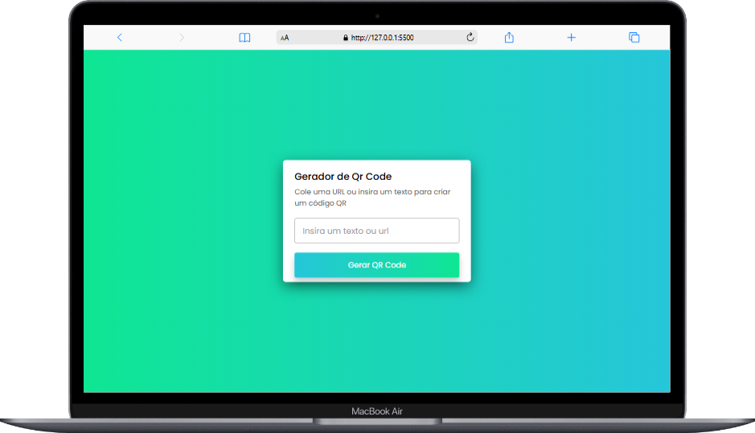

# 💬 Gerador QR Code

Este projeto é um gerador de QR Code simples e eficiente, criado para transformar links, textos ou informações em QR Codes escaneáveis. Com uma interface intuitiva, ele permite a criação rápida de QR Codes.

🌐 **Visite o site:**
[geradorqrcode.vercel.app](https://geradorqrcode.vercel.app)

## 📷 Projeto

**Mobile**

##

**Desktop**

## 🚀 Tecnologias

- **HTML5**: Estrutura do projeto.
- **CSS3**: Estilização e design responsivo.
- **JavaScript**: Lógica de geração de QR Codes.

## ✨ Funcionalidades

- **Geração de QR Codes**: Transforme qualquer link ou texto em um QR Code.
- **Download**: Salve o QR Code gerado como uma imagem.
- **Interface Simples**: Interface de fácil uso e responsiva.

## 📪 Contato

Se você gostou do projeto ou tem alguma sugestão, entre em contato comigo em: mateuszitosilva@gmail.com

---

Código do **Brasil Code**, adaptado por mim para incluir melhorias na interface e opção para fazer o download do QR Code.
